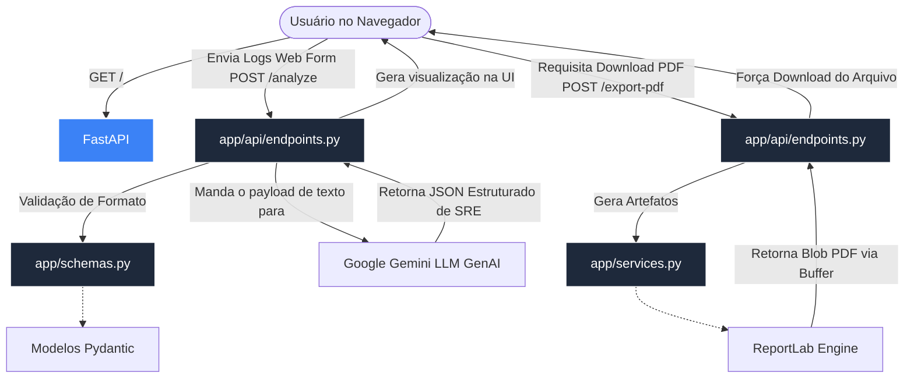

# 🚀 PROD POST-MORTEM AI

**PROD POST-MORTEM AI EXECUTIVE REPORT** é um sistema inteligente concebido para ajudar equipes de Engenharia de Confiabilidade (SRE) e Plataforma. Ele ingere logs massivos, transcrições de chats complexos e cria **Post-Mortems Automáticos** super completos com IA, detalhando as raízes dos incidentes (5 Whys), métricas, impacto no raio de explosão (Blast Radius) e os disponibiliza instantaneamente no seu painel em formato PDF profissional! 

Nós nos orgulhamos de ter uma arquitetura leve, desacoplada e modularizada segundo as melhores práticas modernas do mercado usando Python e FastAPI.

---

## 🏗️ Arquitetura e Fluxo Assíncrono

Utilizamos uma organização rigorosamente isolada, separando o Servidor (Backend) do Cliente (Frontend):



A estrutura interna no seu disco é esta base limpa e escalável:

```text
prod-postmortem-ai/
├── app/                  # Núcleo duro lógico da API (Tudo de Python)
│   ├── main.py           # O Hub Central do app, middlewares e injeções de routes
│   ├── api/              # Rotas divididas
│   │   └── endpoints.py  # Manipuladores de requisição
│   ├── schemas/          # Estruturas Pydantic (Validação Severa e Typos seguros)
│   └── services/         # Handlers externos: Processamento de IA e Geração complexa de PDF
│
├── static/               # Assets Visuais (Nosso Frontend Vanilla Elegante Ultra-Premium UI)
│   ├── index.html
│   ├── style.css
│   └── script.js
│
├── docker-compose.yml    # Orquestração local segura
├── Dockerfile            # Configurações do container com 'uv' (Fast Init)
└── README.md             # Esta super documentação
```

---

## ✨ Features Exclusivas da Plataforma

*   **Multimodal Vision (Evidências de Datadog)**: Arraste e solte capturas de tela dos seus dashboards de observabilidade. O Gemini fará engenharia reversa visual da falha e nosso gerador inserirá nativamente as imagens limpas no PDF final como prova do incidente.
*   **Dynamic Executive Cards (UI Flutuante)**: Através do motor *ReportLab*, eliminamos o conceito de tabelas rígidas. O PDF ajusta fontes dinamicamente e monta uma arquitetura SaaS de fileiras duplas baseadas no que o modelo encontrou: métricas de núcleo (Impactos P1-P3, Status, MTTR) na linha de cima, e SLOs/Contagem de Erros descobertos autônomamente na linha de baixo.
*   **Time Range Engine (Fallback Matemático)**: O SRE virtual detecta conflitos materiais. Se os logs possuírem buracos de tempo, ele utiliza janelas explícitas estipuladas pelos redatores humanos e trava firmemente as bordas de downtime, isolando MTTRs de forma determinística e previnindo alucinações cognitivas no cálculo de SLAs!

---

## ⚡ Como Rodar o Projeto (Passos Rápidos)

Nós preparamos tudo para que seja o mais fácil e moderno de se iniciar o serviço localmente! Siga os passos abaixo, mesmo que você não possua grandes conhecimentos de ambiente:

### 📌 1. Declare sua Chave (Totalmente Grátis)
Abra o [Google AI Studio](https://aistudio.google.com/app/apikey) e crie uma nova API Key para utilizar o Gemini nativo. 
Na pasta raiz deste projeto, simplesmente crie um arquivo chamado `.env`:
```env
GOOGLE_API_KEY=AI...sua_chave_linda_aqui
```

---

### Execução via Docker (Opção Mais Simples - Recomendado)
*Para quem quer 0 esforço de instalação (Requer apenas [Docker](https://www.docker.com/) instado no seu PC):*

1. Abra seu terminal de comando e garanta que você está na pasta do projeto.
2. Digite este comando único e dê enter:
```bash
docker compose up -d --build
```
3. Aguarde uns segundinhos e acesse **http://localhost:8000** no seu navegador!

---

### Execução Nativa usando Python `uv`
*Se preferir trabalhar na máquina crua (Baremetal) ou desenvolver diretamente no código:*

1. Instale o gerenciador ultrarápido oficial (`uv`):
   *(Unix/Mac)* `curl -LsSf https://astral.sh/uv/install.sh | sh`
   *(Windows)* `powershell -ExecutionPolicy ByPass -c "irm https://astral.sh/uv/install.ps1 | iex"`
2. Dentro da pasta, inicie o app sem precisar ativar source manuais:
```bash
uv run uvicorn app.main:app --reload
```
3. O servidor vai abrir! Vá em **http://localhost:8000** no seu próprio browser e divirta-se.